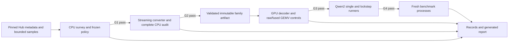

# FamilyTiles research specification

Date: 2026-09-28. Status: authored specification; implementation and research gates are unexecuted.

This document translates the supplied FamilyTiles research brief into implementation contracts. The brief's thresholds and non-goals are retained. Additional engineering decisions are identified below; they define reproducibility and validation behavior, not experimental findings. The existing repository is the project root, and work stays on its current branch, `main`.

## 1. Purpose and claim

Answer whether two real, independently useful Qwen2-family BF16 checkpoints can remain resident as one served anchor plus compact patches, and execute independent matrix–vector products in a shared kernel with useful whole-process memory and latency. Intended use is local side-by-side evaluation, checkpoint regression, and alternating full-checkpoint requests on one M3 Max MacBook.

The proposed contribution is **anchor-coalesced, exact multi-variant execution**. Each target's original weight word is reconstructed before multiplication; an anchor load contributes to two independent outputs with different activation vectors. Floating-point `base_matmul + delta_matmul` does not meet the contract.

A positive result requires real data, complete model execution, reliable process-memory measurement, competitive baselines, and all G5 criteria. A synthetic near-copy, reduced archive size, or successful toy GEMV cannot establish that result. A documented negative result at any gate completes the research at the supported scope.

### Design alternatives

| Approach | Trade-off | Decision |
| --- | --- | --- |
| Small CLI, CPU reference codec, explicit gate records, minimal MLX wrappers | Reuses conversion/streaming/measurement code while keeping gate prerequisites inspectable | Selected |
| Single exploratory script/notebook | Quick first ratio, but ownership, provenance, and numerical controls become difficult to isolate | Use only throwaway analysis, never the reproducible implementation |
| General serving and compression framework | Adds scheduling and abstractions before family redundancy is known | Outside scope |

### Supported surface

- Native arm64 Python on macOS with Metal, one M3 Max and its existing unified memory. No Rosetta, Docker, rented GPU, or OS memory-limit changes.
- Little-endian BF16 safetensors; row-major compatible linear matrices; pinned MLX-LM Qwen2 computation structure. Check stored dtypes and layout from headers.
- One raw anchor and one target, reference depth one. The anchor is itself served. Compress `q_proj`, `k_proj`, `v_proj`, `o_proj`, `gate_proj`, `up_proj`, and `down_proj` first.
- Embeddings, tied heads, norms, biases, and unsupported tensors stay native except verified whole-tensor aliases. Charge all active parameters. Account for unused checkpoint auxiliaries separately.
- Every request retains its own tokenizer, chat template, configuration, activation state, positions, mask, and KV cache. Matching shapes alone do not authorize grouping or semantic sharing.
- Inference only. No training, automatic anchor search, patch chains, clustering, CUDA, PyTorch, vLLM, MoE, distributed execution, custom attention/KV compression/allocator, GPU entropy decoder, online updates, HTTP API, production scheduler, browser UI, or FP16/FP8/GGUF/LoRA conversion expansion.

Native released adapters and quantization may be preferable for deployments with different contracts; this project does not claim universal superiority.

## 2. Correctness contracts

| ID | Claim | Required evidence |
| --- | --- | --- |
| C1 | Representation exactness | CPU and GPU recover every original BF16 word, including signed zero, exceptional values, and NaN payloads; zero bit mismatches |
| C2 | Codec-transparent arithmetic | Packed and raw controls have identical arithmetic/reduction, bias, precision, and cast; bitwise output equality on finite inputs |
| C3 | Compatibility with stock MLX-LM | Saved logits, NLL, argmax and generation comparisons; raw-control aggregate logit normalized RMS ≤ `1e-3`, argmax agreement ≥ `99%` |

For statistics accumulated in CPU FP64, normalized RMS is `sqrt(sum((test-ref)^2) / max(sum(ref^2), 1e-24))`. Aggregate logits use the same formula over all compared entries, not an average of per-chunk ratios. Record maximum absolute error too.

C1 is never an `allclose` test. C1 does not imply identical greedy generation. Stock differences caused by reduction order are reported separately from any codec error. A materialize-one-matrix → stock matmul path is mandatory for correctness and prefill. No rounding, thresholding, sparsification, or retraining changes source weights.

## 3. Gates and frozen decisions

The following are predeclared engineering thresholds, not predictions. Freeze the acceptance policy before opening holdout samples. Preserve failed and censored runs. A threshold change constitutes a new research protocol and cannot retroactively pass this one.

| Gate | Work and prerequisite | Advance criterion | Failure disposition |
| --- | --- | --- | --- |
| G0 | Environment, memory budget, custom-kernel smoke, closest prior-art collision audit | Arm64/Metal runs uint16 reconstruction and tiny BF16 stock matmul; tested versions pinned; no confirmed duplicate of the contribution | Stop unsupported platform; classify a confirmed duplicate as reproduction/platform extension |
| G1 | G0 pass; bounded real headers/configs/samples; CPU estimator and controls | Conservatively projected full active-weight bytes at least `15%` below B1, and saving beyond B2 at least `5%` of raw family active-weight bytes | If both Qwen pairs fail, report and stop; acquisition failure is separate from size failure |
| G2 | G1 pass; only selected family full download, streaming conversion and complete CPU audit | Actual complete representation meets both G1 size thresholds; conversion/runtime/scratch fit budget | Report sample optimism, native coverage, or memory failure; no GPU optimization |
| G3 | G2 pass; full bounded GPU word audit, raw and fused single/pair GEMV | C1/C2 pass; pair sweep time ≤ `1.5×` best native pair baseline; no fused full-matrix allocation | Stop after bounded tuning if incorrect or impractical |
| G4 | G3 pass; raw and packed model runners, streamed prefill, C3 and lifetime checks | All numerical checks, active inventory, independent state, and transient/ownership bounds verified | Narrow to matrix/representation result where integration fails |
| G5 | G4 pass; fixed benchmark matrix, competitive exact and lossy references, generated report | Every full-positive criterion in §14 passes | Report the supported partial or negative result |

Define `W0` as B0's total family unique active-weight bytes, counting within-model ties once; `W1` as B1's actual full representation with verified cross-model tensor aliases; `W2` as B2's canonical COPY/RAW representation; `WF` as FamilyTiles canonical bytes including metadata/padding/native leftovers. Size gates require `(W1-WF)/W1 >= 0.15` and `(W2-WF)/W0 >= 0.05`. Do not substitute projection-only or file-size denominators.

G1 need not beat every Zstd archive. Direct consumption and generic streaming have different latency costs. Kernel tuning permits the first correct layout plus at most two deliberate layout changes; record the reason, source hash, outcomes, and corresponding raw controls for each.

### Gate records and stale evidence

Each record stores schema version, gate, family/revision IDs, format/policy/environment/code hashes, input evidence paths and hashes, thresholds, observed values, decision, and reason. Decisions are `pass`, `fail`, `blocked`, or `not_run`; blocked means unavailable acquisition/platform/evidence, never a measured compression failure. Individual measurements can additionally be `timeout`, `unsupported`, or `not_applicable`.

Commands check prerequisite records against the exact family, policy, and artifact. A changed format/revision invalidates dependent evidence. Equivalent numerical checks may be reused only when code/kernel/operator configuration, inputs, and artifact hashes match. Records are append-only by run ID; a failure must not leave an old selection artifact silently usable.

Hash the relevant producer/dependency content for each evidence stage and record the repository commit separately. Documentation-only commits and newly added downstream modules do not invalidate unchanged earlier measurements. Changes to a gate's producer or numerical/format dependencies invalidate affected checks; define those dependencies explicitly and rerun them. A Git commit identifier alone is insufficient to decide whether evidence is reusable.

An early-stop report is available at every gate. G0/G1 failure does not require implementing kernels or all later baseline runners just to render a report. No override flag silently bypasses a failed gate.

## 4. Machine, acquisition, and process limits

Use the existing repository root; do not create another nested repository. Python virtual environment and editable package dependencies begin with `numpy`, `zstandard`, `huggingface_hub`, `safetensors`, `requests`, `pytest`, `psutil`, `mlx`, and `mlx-lm`. Add the dataset reader at evaluation preparation. MLX imports stay lazy so CPU codec tests can run without Metal; install MLX dependencies conditionally on compatible macOS arm64. Do not install PyTorch to read BF16 words.

G0 selects versions that actually pass the smoke tests, pins package versions and relevant upstream source commits, saves `results/requirements-lock.txt`, and makes the installation reproducible. No version is asserted tested in this planning document. Record Python version, package source/version, macOS, arm64/Rosetta status, CPU/GPU, physical/available memory, device data, source revision, compiler/custom-kernel API and capability checks in `results/environment.json`.

The process research budget is:

```text
B = min(12 GiB, 0.40 × installed physical memory,
        0.60 × currently available memory)
```

Recheck before full conversion and every benchmark process. Reserve space for Python, source buffers, activations, KV and scratch when setting MLX limits. Cache cap is initially `256 MiB` for all compared modes; collect a separate cache-disabled diagnostic. MLX limits are not OS-wide caps. Do not raise wired limits, GPU sysctls, disable safeguards, or force OOM/swap.

G1 reads at most `32 MiB` of tensor samples per checkpoint, with a `160 MiB` total target for the two prescribed Qwen pairs. Four full sample allowances consume `128 MiB`; record headers/configs/tokenizer metadata and request overhead separately. Enforce sample byte limits on actual transfer, including retries and overreads, not just retained samples. New model-weight downloads across the selected implementation run are capped at `7 GiB`; keep a run-level ledger that cannot reset on retries or fallback. Reuse cached files only after revision/size/integrity validation; report cache reuse separately.

Inspect actual shard sizes before full acquisition; download the smallest passing pair first. Never automatically fetch both complete Qwen sizes. If acquisition blocks range sampling, a bounded download of the smallest pair can be a separately recorded acquisition fallback within the same budget; it does not authorize runtime work before G1 passes. A later fallback must fit the remaining aggregate budget.

Every benchmark cell has a `120-second` execution cap. A timeout is censored, never treated as a completed time. This cap applies to benchmark execution, including the cell's setup/warmup, while excluding prior model downloads and compilation prepared outside steady timing; save the exact boundary. It is not a limit on implementation or full conversion.

## 5. Architecture, data flow, and ownership



Keep small modules with explicit responsibilities. A few focused additions to the brief's minimal tree prevent a single CLI/measurement module from owning unrelated policy.

| File | Responsibility |
| --- | --- |
| `src/familytiles/cli.py` | argparse commands, path resolution, prerequisite checks, exit codes |
| `src/familytiles/records.py` | Versioned records, gate evaluation, hashes, atomic writes and evidence identity |
| `src/familytiles/data.py` | Pinning, safetensors metadata validation, bounded reads/download ledger |
| `src/familytiles/survey.py` | Deterministic samples, strata, development selection and holdout projection |
| `src/familytiles/codec.py` | Integer transforms, descriptors, packing and exact CPU decode |
| `src/familytiles/convert.py` | Streamed container writing, inventory, alias verification, complete audit |
| `src/familytiles/baselines.py` | Exact Zstd transforms/providers and native/quantized baseline setup |
| `src/familytiles/metal.py` | Validated MLX wrappers, generated Metal accessor/control source and launch configuration |
| `src/familytiles/model.py` | Strict parameter loading, FamilyLinear and minimal Qwen2 lockstep runner |
| `src/familytiles/measure.py` | Fresh-process timing, allocation/footprint tracing and memory budget |
| `src/familytiles/evaluate.py` | Pinned corpus/token fixtures, numerical and generation checks |
| `src/familytiles/report.py` | Pure report generation from validated saved records, including early stops |
| `tools/footprint.c` | Optional SDK-compiled `proc_pid_rusage` physical-footprint probe |

Dependencies flow from CPU records/codec/data to survey/conversion, then Metal/model, then measurement/evaluation/reporting. CPU modules must not import or initialize MLX. Tests are split by their owners, with the public entry suites `test_codec.py`, `test_metal.py`, and `test_model.py` retained. GPU/model markers explicitly skip unavailable requirements; skips cannot pass a research gate.

### Resident ownership

The converter runs separately. A measured fused-decode child owns one raw anchor allocation, target descriptors/payloads/native leftovers, verified aliases, separate request KV, activations, and bounded scratch. It owns no full source target NumPy array, hidden original model dictionary, decoded target model, dense numeric delta, or source mapping. Load immutable operands directly. Native fallback and aliases are first-class records, not packed tensors with gratuitous descriptors.

The runtime verifies whether BF16/uint16 views share storage. If the pinned MLX API cannot provide a no-copy view, redesign storage/access or include the duplicate allocation and fail the memory gate as appropriate. Casting through FP16 is forbidden. Debug reconstructions cannot remain live during measurement. Touch the intended resident store before measuring hot-memory operation.

## 6. Data selection and bounded survey

| Role | Anchor → target | Acquisition |
| --- | --- | --- |
| Primary | `Qwen/Qwen2.5-0.5B` → `Qwen/Qwen2.5-0.5B-Instruct` | Headers and samples; first complete candidate [D01, D02] |
| Prespecified fallback/scale check | `Qwen/Qwen2.5-1.5B` → `Qwen/Qwen2.5-1.5B-Instruct` | Headers/samples first; full only if selected and budget permits [D03, D04] |
| Optional codec-only distribution check | `HuggingFaceTB/SmolLM2-360M` → `HuggingFaceTB/SmolLM2-360M-Instruct` | After format freeze; only actually stored BF16 tensors; no second architecture [D05, D06] |

Resolve immutable commit SHAs before any sample. Save configuration/tokenizer/template hashes, license metadata, shard names/sizes, tensor names/shapes/dtypes, active inventory decisions and SHA-256 of every acquired sample. Samples and weights remain ignored local artifacts; retain their provenance in version control. Never splice revisions. Different-sized Qwen families are not paired with each other.

### Reader contracts

Safetensors begins with an eight-byte little-endian header length; offsets are relative to the subsequent data section. Validate file/header bounds, dtype element sizes, shape products with overflow checks, offset ordering and nonoverlap, and requested extents. Set a project header-size cap of `16 MiB` per shard; exceeding it is explicit unsupported metadata, not permission to fetch an unbounded header. Reject malformed or duplicate tensor definitions and invalid JSON metadata. These format-reading choices follow the documented metadata access pattern [F04, F05].

Require HTTP 206 with a matching `Content-Range` for manual ranges, the expected content length, and identity transfer encoding. Use streaming and hard byte bounds. If the server responds HTTP 200, abort without buffering the whole shard and record acquisition failure. A retry uses the same immutable SHA and consumes the remaining budget. Store only complete validated samples. Resolve artifacts/output paths under the repository; reject manifest path traversal, absolute external paths, and symlink escapes.

### Sampling and freeze order

Use seed `20260928`. Sample complete contiguous within-row microblocks covering all seven projection roles, early/middle/late layers, and several row positions. Include embeddings/head/native categories in the ledger even when sampled only for diagnostics. Align sample windows to 256-word row blocks where possible so every 64/128/256 candidate sees equivalent source bytes and row tails. Stratify by role and layer band; keep actual row/tensor identities.

Assign disjoint parent windows to `70%` development and `30%` holdout before reading outcomes. All subblocks of one parent stay in one split. Save the selection/split manifest and threshold policy hash. Use development data alone to choose block size in `{64,128,256}`, transform menu, and B3 field transform. Save the frozen per-family candidate policy before opening its holdout. Freeze policies for both prescribed pairs before interpreting holdout comparisons; do not use a failing holdout to retune the next family.

Measure XOR and ordered-key deltas. Retain both only when their development-weighted improvement over the better single transform is at least `2%` of raw family active-weight bytes; otherwise retain the better single transform. COPY, RAW and width-zero sparse literals always remain possible. Per-tile mode choice from the frozen menu is permitted on the full scan.

For each stratum, use the worse development/holdout byte estimate, weighted by actual full tensor/role sizes. Unsampled/unsupported regions use native cost. Whole-tensor aliases require complete bytes; sample matches alone cannot prove an alias. For an uncertain B1 denominator, conservatively allow all unresolved compatible tensors to alias in B1, or report the B1 bound as unresolved and block selection; never inflate B1 using unverified distinctness. One differing sample proves nonidentity. Record lower/upper estimates and why the chosen G1 projection is conservative.

Report original bytes, exact observed matches, tile-dedup cost, residual distributions, packed allocated bytes, descriptors/exception/alignment costs, native leftovers, mode fractions and largest residual ranges by role and family. Estimate Zstd from contiguous bounded windows; do not concatenate unrelated samples as though they formed a real 256 KiB chunk. Label estimates and uncertainty explicitly.

Controls with the same shapes: identical data and known sparse changes; independent random uint16 words; deterministically shuffled target; sign/exponent-crossing patterns. Controls validate behavior and cannot make a family eligible.

## 7. Exact codec and container version 1

Operate on original little-endian two-byte words using integer arithmetic. No codec operation interprets floats.

### Transforms

For anchor `a` and target `t`, XOR residual is `a XOR t`, and inversion repeats XOR.

```text
key(w) = (~w) & 0xffff       if w & 0x8000
       = w ^ 0x8000          otherwise
d = int32(key(t)) - int32(key(a))
z = 2*d                     if d >= 0
  = -2*d - 1                otherwise
d = z//2                    if z is even
  = -(z+1)//2               otherwise
k = int32(key(a)) + d        # require 0 <= k <= 65535
word = k ^ 0x8000            if k & 0x8000
     = (~k) & 0xffff         otherwise
```

The signed difference spans `[-65535,65535]`; zigzag spans `[0,131070]` and needs **17 bits**. Use int32/uint32 intermediates, validate reconstruction range, and preserve every exceptional payload. Integer ordering is a coding device [P01].

### Blocks and byte cost

Rows contain independent blocks of the frozen `B` values; the final block uses `n <= B` valid values. For shape `(M,K)`, descriptors count is `M * ceil(K/B)` in row order. Zero-length codec input has no blocks; zero-sized GEMV is explicitly rejected.

| Mode | Stored data | Target accessor |
| --- | --- | --- |
| COPY | No payload | Anchor word |
| RAW | `n` literal target uint16 words, pad to four bytes | Literal target, no anchor required for target-only execution |
| PACKED | Low codes, optional exception bitmap, exceptional literal words, padding | Residual inversion or original literal |

PACKED widths are `{0,2,4,8}`. A lane is normal iff residual `< 2^b`. Exceptions store the original target word; low code placeholders are zero. Low stream occupies `4*ceil(n*b/32)` bytes in lane order, least-significant code first; width zero has no stream. If exception count `e > 0`, append `ceil(B/32)` uint32 mask words and `2*e` literal bytes in lane order. All padding and invalid tail mask/code bits are zero. If `e=0`, omit masks/literals entirely. Mask rank is popcount of preceding words plus lower bits of the current word; no cross-block adaptive state.

Actual tile cost is eight descriptor bytes plus aligned payload bytes, except tensor alias/native records which carry no per-tile descriptors. Choose least allocated cost; deterministic ties prefer COPY, RAW, then PACKED by increasing width and XOR before ordered delta. Compare aggregate tensor cost with native and take native when no smaller. Include serialized metadata in canonical totals. A 128-value block with width four and two exceptions uses `8+64+16+4=92` bytes; raw words alone use `256`. This is an example, not a model estimate.

### Descriptor layout (explicit engineering choice)

Each descriptor is two little-endian uint32 words. Word 0 is the payload offset divided by four. Word 1 is:

| Bits | Field | Values |
| --- | --- | --- |
| 0–1 | mode | 0 COPY, 1 RAW, 2 PACKED; 3 invalid |
| 2–3 | width selector | 0→0, 1→2, 2→4, 3→8 |
| 4 | transform | 0 XOR, 1 ordered-key delta; must be enabled by policy |
| 5–13 | exception count | 0 through `n` inclusive; nine bits allow 256 |
| 14–31 | reserved | zero |

COPY uses both words zero. RAW uses only mode bits and its offset; no width/transform/count. PACKED uses the fields above. The shape supplies `n`; payload sections are derivable without scanning other blocks. Require offsets/extents within a per-tensor payload of at most `2^34` bytes, calculate extents with wide checked arithmetic, and reject overflow. No other offset width is introduced silently. Validate nonoverlapping payload extents, mask popcount equal to count, count ≤ valid lanes, zero placeholders/tail bits/padding, and transform bounds before launch. Decoder validation may stream bounded chunks and does not retain a full reconstructed tensor.

### Container and streaming

Use JSON manifest plus per-tensor flat binary arrays (standard `.npy` with `allow_pickle=False` is acceptable if accounted consistently). Each packed tensor has one descriptor array and one payload array; never one Python object or allocation per tile. Native and anchor arrays store original bytes. All arrays are immutable after validation.

Manifest includes schema/format version, byte order, family/revision/config/tokenizer identity, frozen policy/hash, anchor identity/hash, active inventory, shape/dtype/role, native/alias/packed kind, extents, source hashes, file hashes, storage IDs, unique-byte ledger, source attribution and original target tensor SHA-256. Alias requires compatible coordinates and exact byte comparison after hash lookup; retain within-model ties. Reject tied-head declarations inconsistent with separately stored incompatible data.

Stream one tensor or bounded row chunk at a time, including equality checks and hashes. Write into a temporary output directory; finalize only after complete validation and CPU round-trip/hash checks. Interrupted output is never loadable as a completed artifact. Close mappings and discard NumPy copies before any runtime child begins. Reject wrong anchors, revisions, versions, dtypes/shapes, truncation, illegal modes/counts/reserved bits, unexpected aliases/cycles, overflow and hash mismatch. No pickle or remote model code.

## 8. Metal primitives

G0 runs only a tiny custom-kernel capability probe; substantive GPU codec/performance work begins after G2. The public conceptual operations are:

```text
decode_words(anchor_u16, encoded_target) -> target_u16
raw_gemv(raw_words, x, bias) -> y
raw_gemv_pair(anchor_words, target_words, x_anchor, x_target, biases) -> (y_anchor, y_target)
family_gemv(anchor_words, encoded_target, x, bias) -> y
family_gemv_pair(anchor_words, encoded_target, x_anchor, x_target, biases) -> (y_anchor, y_target)
```

`decode_words` first proves C1 against original integer words on every mode/tail and every encoded real tensor in bounded chunks. Do not cast to BF16 before comparing. In arithmetic kernels, expand a word exactly using FP32 bit pattern `uint32(word) << 16`. Exceptional patterns are integer-decoder tests; inference arithmetic checks use finite inputs.

Generate raw and packed accessors within the same source structure so K traversal, FP32 accumulation, reductions, bias placement, output cast, and compiler options match. Begin with row-oriented SIMD/threadgroup reduction, a small row group, and block-aligned traversal. One deterministic two-stage reduction is allowed with bounded, charged partial sums and the identical raw schedule. Do not change fast-math between controls. Record kernel source, launch configuration, compiler options, and scratch formula.

The pair kernel loads the anchor once per coordinate in its source/access pattern, derives the target word, and updates independent accumulators from independent inputs. RAW target tiles still need the anchor for the anchor output. COPY/native paths avoid unnecessary decoding; single native target mode does not read the anchor. Both variants' biases and casts remain independent. No global decoded matrix, dense floating delta, per-token anchor copy, or stacked raw-weight allocation is allowed in the timed path.

Check the pinned custom-kernel contiguity behavior once, prepare contiguous immutable inputs at load time, and reject unsupported strides at the wrapper boundary. The documented custom Metal API is the starting point; actual availability and semantics are tested in G0 [F02]. If profiling is available, corroborate shared anchor use/no decoded writes; distinguish source inspection from hardware traffic measurement.

Controls are two separate fused single calls (A2), raw pair (A3), raw single, and the faster of stock MLX's two matvecs or a compatible batched operation with weights prepared once. Never optimize against an intentionally poor raw control. Sweep actual early/middle/late projection operands, including narrow KV and wide MLP shapes, in order; headline sweep time is the sum of representative work, not the average of speedup ratios. Freeze sweep inventory and byte weights before timings. Report a repeated hot matrix separately. Record any working set that cannot exceed cache as a limitation.

The modeled encoded traffic is approximately `(1+d)W` for a lone patched request versus native `W`, and `(1+d)W` for the pair versus `2W`; `d` includes patch metadata. At `d=0.40`, pair operand bytes fall by a modeled `30%`. These are not measured DRAM bytes or speed predictions. Cache, reconstruction instructions, register pressure, attention and heads can erase the benefit.

## 9. MLX-LM integration and lifetime

Use the pinned MLX-LM Qwen2 implementation for projection layout, biases, head tying, rotary/mask/cache/attention operations, normalization and activation [F01]. Adapt only enough code for the small runner, retain source attribution, and inspect compatible configs beyond tensor shapes. Load no remote model code.

### Single model and strict loading

Build the structure from its pinned config, replace supported linears, and load directly from validated native/alias/packed records. Every required active tensor must have exactly one semantic source. Reject unexplained missing/unexpected active tensors; do not hide them with unrestricted `strict=False`. Avoid evaluating full-size random placeholder parameters. Keep tied heads and embedding storage genuinely tied. Track loaded unique storage IDs, not object counts.

`FamilyLinear` has single-token fused decode, streamed prefill, and explicit debug word reconstruction. Preserve bias/output dtype. For more than one input token, materialize one matrix, use the stock matmul, evaluate outputs and required state, release graph references, then reconstruct the next. Measure the actual bound if two matrices/outputs overlap. MLX evaluation is lazy; deleting a Python name alone does not free its graph inputs [F06]. No permanent decoded target after prefill or `clear_cache()` per token as a lifetime workaround.

### Raw lockstep before packed lockstep

First run two models in lockstep using raw operands and validate against separate stock execution. At each layer, pair corresponding linears with the two current activations; apply attention/nonlinear operations separately using each model's state. Native embedding/head operations remain per model. If configs/operator structures cannot support the same schedule, reject pairing with an explicit reason; the single path remains meaningful.

Prefill independently through the streamed path. Advance exactly two ready streams, then use R=1 when one ends. Different histories and cache positions are required; even identical prompts never justify shared KV. Cancellation frees only that request's state; restart creates fresh KV. No request-waiting or continuous-batching framework is needed.

Before compressed operands, C3 raw-runner versus stock must pass over the fixed corpus. Then packed fused must match raw-control runner outputs bitwise under the same schedule; materialized must match its corresponding native stock-operator runner. A failed raw regression must be debugged or restrict the result to the materialized path; thresholds remain fixed.

After warmup, at least `20` short request lifecycles must release live memory to within `max(16 MiB, 1% of canonical weights)` of warmed idle after request/KV release. Inspect monotonic growth as failure even if each short run appears within a local allowance. Allocator cache and live arrays are separate. Fresh child processes per mode ensure converter/debug/other-model objects cannot contribute hidden resident copies.

## 10. Baselines and ablations

All measured modes use the same pinned model revisions, active semantics, saved tokens, cache precision and workload. Approximate representations are labeled. No CUDA throughput is copied into M3 tables.

| ID | Mode | Required purpose/accounting |
| --- | --- | --- |
| B0 | Stock native BF16 MLX-LM, normal within-model ties | Actual reference; do not duplicate a tied head |
| B1 | B0 plus exact compatible whole-tensor aliases across models | Main exact-sharing denominator and inference reference |
| B2 | COPY/RAW only with native fallback | Same block/descriptor/container accounting as FamilyTiles; no nonzero residual compression; measure runtime after kernels exist |
| B3 | Independently encoded exact Zstd operands, owned compressed RAM, streamed stock matmul | Include descriptors, chunk indexes, decoded staging, all native exclusions and copies |
| B4 | Family XOR/ordered-key deltas + Zstd, streamed stock matmul | Include anchor form, transform cost and both reconstruction stages |
| B5 | One hot decoded model with best implemented exact compressed backing in RAM | Charge hot model, any retained backing copy, reconstruction on miss and switch peaks/queue time |
| B6 | Native MLX packed 8-bit and 4-bit conversions | Count packed buffers, scales, biases and native exclusions; report NLL change; explicitly lossy [F08] |
| A1 | FamilyTiles materialize-one-matrix + stock matmul | Codec size/correctness separated from fused compute |
| A2 | Two separate FamilyTiles R=1 calls for ready pair | Grouping ablation |
| A3 | Raw pair with identical arithmetic layout | Exposes dispatch benefits and custom-kernel weakness |

B2 permits whole-tensor alias and native fallback, uses the frozen block size, and charges descriptors/alignment/metadata. G1/G2 incremental savings compare its complete canonical bytes against FamilyTiles. Do not compare to a padded or unnecessarily expanded dedup baseline.

B3 uses Zstd level `3` and independently decodable chunks of approximately `256 KiB` (131,072 BF16 values except tensor tail). On development data choose native, byte-plane, or a reversible BF16 exponent/sign-fraction split; retain native fallback. Define the field split as exponent `(word >> 7) & 0xff` and sign/fraction `((word >> 8) & 0x80) | (word & 0x7f)`, inverse `((sf & 0x80) << 8) | (exp << 7) | (sf & 0x7f)`. Exhaustively test it. Chunk boundaries must not cross tensors; indexes/headers count.

B4 tries XOR u16 and ordered-key zigzag u32, byte-plane transformed before Zstd. A 17-bit residual stays u32 before compression. Audit both raw-anchor and independently compressed-anchor forms, choose the smaller practical complete resident form for streaming, and charge bounded anchor/target staging and full reconstruction costs. These are **BitX-inspired** and **FM-Delta-inspired** local baselines, not reproductions of the upstream systems. Do not infer algorithmic dtype support from a failed package build.

B3/B4 share the materializing operand provider and evaluation boundaries. Keep encoded stores in owned, touched RAM. Disk-backed loading is a separately labeled storage experiment. B5 uses the best implemented exact backing from these audits, releases the old decoded model before replacement as budget requires, and tests both sticky and alternating request orders. No hidden helper process holds another full decoded model.

If the selected target has an official compatible unmerged adapter, benchmark it with its documented base. Otherwise record `not_applicable` with source evidence; do not synthesize/train/factorize an adapter. Full-checkpoint results say nothing about outperforming adapter-native deployments [P17–P19].

## 11. Memory and timing evidence

Maintain a ledger of unique raw anchor allocations, target descriptors/payloads, unique native leftovers and alias metadata; then add each request's KV, activations/logits, staging/reduction scratch, retained framework cache, runtime copies, Python buffers and mapping overhead. Distinguish file bytes, active parameters, canonical format bytes, loaded unique allocations, steady decode, startup/prefill/switch peaks.

For equal models, `W + (1-f)W + fdW` gives family weights and raw-family saving `f(1-d)/2`; `f=0.70,d=0.40` gives `21%`, before runtime overhead. Report B1's actual aliasing instead of substituting this illustration. Any many-model extension is an unmeasured formula until tested.

Use tested MLX active/peak/cache counters and limits, capability-checked in G0 [F07]. Save RSS separately. For physical footprint, compile a helper against installed SDK structs using `proc_pid_rusage` and `ri_phys_footprint`, checking return codes and validating change with a known touched allocation [F09]. Do not use hard-coded ctypes offsets. A failed physical probe permits canonical/MLX claims only, so the full G5 physical-RAM criterion cannot pass.

One unified pool serves CPU and GPU [F03]. Never sum RSS + MLX active + physical footprint. Sample physical/active/cache time series during phases; sampled peaks are lower bounds on instantaneous peaks. MLX peak active is complementary, not active-plus-cache. Use the maximum comparable sampled core-phase footprint for the acceptance comparison, corroborated with allocations/counters. Detailed traces come from separate matched memory runs with identical model, inputs, cache policy and iteration counts. Record swap/compressed-memory pressure before/after; swap growth or heavy pressure invalidates clean in-RAM timings.

Warm each shape/mode and force evaluation, with compilation outside steady timing. `perf_counter_ns()` brackets actual new evaluated work and explicit GPU synchronization. Rotate a fixed pool of distinct activations or advance token state; repeated evaluation of an already-realized array is invalid. Generate inputs, hash, tokenize and capture native activations outside timing. Count dispatch/reconstruction/synchronization consistently.

Use external power; record power mode and other GPU activity. Three independent trials alternate baseline/treatment order. Report each trial, medians, p95 per-stream token latency and spread of trial summaries. Tokens within a trial are not independent replications. Preserve cold initialization, conversion and startup costs separately. Capacity is reported only for named safely tested budgets, never by forcing OOM or extrapolating tiny arrays to a larger model.

## 12. Verification experiments

### E0 — model-free correctness and robustness

Exhaustively round-trip all `65,536` words through ordered key/inverse. Test every target word against representative anchors `0x0000,0x8000,0x0001,0x7f80,0xff80,0x7fff,0xffff`, plus at least `1,000,000` seeded random pairs through each transform. Include differences ±65,535 and 17-bit zigzag extrema.

Test COPY, RAW, all widths, absent/zero/all/mixed exceptions, every exception position, mask-word boundaries, row tails, multiple rows, zero-length codec inputs and dimensions `1/31/32/33/127/128/129` plus selected-block boundaries. Assert sign/NaN payload preservation. Test complete incompressible tensors choose native when tile overhead loses. Bounded descriptor/header/payload mutation and truncation tests must reject before Metal launch. Cover maximum offset arithmetic using synthetic metadata, not giant allocations.

### E1 — real-data survey and full conversion

Record both prescribed Qwen screens and all controls. Only selected, passing data advances. Complete CPU word/hash verification covers every active tensor, including native and aliases; the complete size audit reports identity, transforms, widths, exceptions, descriptors, padding and native leftovers. GPU reconstruction later covers every encoded tensor in bounded chunks. Optional SmolLM2 is a format-frozen, codec-only distribution check; it cannot replace a failed Qwen family for the central claim.

### E2 — primitive checks

Use real early/middle/late layer weights/roles, random BF16 activations and a few activations captured from untimed native execution with saved hashes. Compare single/pair packed to same-schedule raw bitwise; report max absolute/normalized RMS raw-vs-stock errors. R=2 unrelated inputs is required; identical inputs is diagnostic. Record complete sweep and separate hot case, all required controls and allocation bounds. Native activation capture at G3 may use stock MLX-LM in an isolated untimed process; it does not authorize custom model integration before G3.

### E3 — numerical regression

Pin `Salesforce/wikitext`, configuration `wikitext-2-raw-v1`, test split only [D07]. Preserve license, revision and source hashes. Concatenate dataset text in dataset order with a single newline between rows; tokenize separately per model. Select the first eight disjoint windows of `257` tokens at starts `0,257,...,1799`, with an explicit saved special-token policy and no chat templating. Save IDs and hashes; each model has `2,048` next-token predictions. This selection is an engineering choice that makes the brief's eight-sequence protocol deterministic.

Run inference/eval without sampling. Compare stock BF16, raw-control runner, FamilyTiles materialized and fused logits/NLL on identical per-model IDs, masks, positions and cache precision. Chunk vocabulary logits if needed, accumulating NLL and error statistics exactly over the selected predictions. Enforce C3 before core benchmarks; disclose low-margin argmax disagreements. Require packed-vs-raw outputs bitwise and materialized-vs-corresponding stock-operator outputs exact under the matched configuration. B6 reports NLL difference on these same inputs, with quantization mode/group size/exclusions recorded; this is a small regression set, not a comprehensive quality evaluation.

### E4 — generation, independent cache and release

Store these strings verbatim in `experiments/prompts.json`:

```json
[
  "Explain why binary search requires sorted input. Give a small example.",
  "Write a Python function that merges two sorted lists without modifying them.",
  "A tank contains 60 liters of water. It loses 3 liters per minute. How much remains after 7 minutes?",
  "Summarize the difference between a process and a thread.",
  "Continue this story: The librarian found a map hidden inside the oldest book.",
  "Give three test cases for a function that computes the median of a list.",
  "Translate into French: The train leaves tomorrow morning at eight.",
  "Explain the difference between a cache hit and a cache miss."
]
```

Generate up to `64` greedy tokens/model; save full IDs and first divergence from both native and raw controls. Separately smoke-test each model's documented chat formatting. Throughput uses saved explicit IDs. Check two distinct prompts, unequal lengths/cache positions, early finish, switching R=1/R=2, cancellation/restart and repeated fresh state. Each stream must match its separately executed control. Perform the ≥20 lifecycle memory test in §9.

## 13. Workload matrix, commands, and records

| Suite/workload | Inputs | Modes |
| --- | --- | --- |
| `kernel` / viability | Real role/layer sweep; R=1/R=2; hot diagnostic | Stock native, raw single/pair, fused single/pair |
| `core` / paired | Two distinct saved prompts, each 256 tokens; 32 measured decode forwards each | B1, B2, B3, B4, A1, A2, A3, FamilyTiles pair |
| `eval` / quantization | Same 256/32 inputs | B6 8/4-bit; reuse matching BF16/FamilyTiles evidence |
| `eval` / long prefill | 1,024 tokens, 32 measured forwards | B1, FamilyTiles and best core exact streaming alternative |
| `switch` / sticky and alternating | Eight 64-token prompts, 16 steps/request; AAAABBBB and ABABABAB | B1, B5, FamilyTiles R=1 |
| `stress` / isolation | 64/256-token unequal prompts, early ending and lifecycle checks | Native/raw controls and FamilyTiles |

Core prompt indices are 0 and 1 from §12, tokenized per target. Truncate to requested length, or cyclically repeat that prompt's token IDs to extend it; save resulting IDs before timing. Switch requests cycle the eight fixed prompts, with A/B identifying the model. Pin continuations from an untimed stock greedy run, continuing a fixed number of steps regardless of EOS for equal work. A measured decode step is one post-prefill forward; do not count the token predicted by prefill. Natural EOS/generation remains E4. Save every input/continuation hash and exact completed model-token counts.

Measure TTFT, total completion, aggregate paired model-token steps/wall time, and each stream's inter-token/completion latency. Requests are already ready; charge any waiting/serialization. First try each slow streaming baseline on one core trial with the cap. If censored, obtain one short completed comparable case across all compared modes or leave ratios unclaimed; do not multiply timeouts across contexts. Save shortening as a different workload, never a substitute G5 core run.

Predeclare utility comparisons: B3/B4 on core and 1,024-token prefill; B5 on both sticky and alternating switch workloads. Choose the strongest applicable completed exact alternative from these named modes, not a favorable arbitrary baseline. Where alternatives trade memory for latency, report the applicable frontier and demonstrate the utility margin against its strongest comparable point(s), rather than hide a dominating alternative. Missing/censored necessary competitors leave the utility claim unverified.

### CLI contract

All paths below are relative to this repository. Commands are implementation targets, not existing functionality. They write structured records even on measured gate failure; exit `0` on successful command/pass, `2` on invalid input/prerequisite, `3` on measured gate failure, `4` on acquisition/platform blockage, and `5` on benchmark timeout. A report can exit zero while describing failed research. No heavy action happens before prerequisite validation.

```bash
python3 -m venv .venv
source .venv/bin/activate
python -m pip install --upgrade pip
python -m pip install -e .
python -m pip freeze > results/requirements-lock.txt
python -m familytiles.cli doctor --out results/environment.json
python -m pytest tests/test_codec.py -q

python -m familytiles.cli survey \
  --families experiments/families.json \
  --sample-mib-per-model 32 --seed 20260928 --out results/survey

python -m familytiles.cli convert \
  --family results/survey/selected-family.json \
  --policy results/survey/frozen-policy.json --out artifacts/family
python -m familytiles.cli verify --artifact artifacts/family --device cpu

python -m pytest tests/test_metal.py -q
python -m familytiles.cli verify --artifact artifacts/family --device gpu
python -m familytiles.cli bench --artifact artifacts/family --suite kernel

python -m pytest tests/test_model.py -q
python -m familytiles.cli verify --artifact artifacts/family --scope model
python -m familytiles.cli bench --artifact artifacts/family --suite core
python -m familytiles.cli bench --artifact artifacts/family --suite eval
python -m familytiles.cli bench --artifact artifacts/family --suite switch
python -m familytiles.cli bench --artifact artifacts/family --suite stress
python -m familytiles.cli report --results results --out RESULTS.md
```

Implementation creates `results/` before the freeze command. `doctor` produces environment evidence and evaluates G0 once the separate completed `prior_art.md` audit/record is available; it cannot claim novelty clearance from hardware alone. `survey` freezes policy before holdout and writes G1/selection; `convert` and CPU verify produce G2; GPU verify plus `kernel` produce G3; model verification produces G4 including cache-isolation/lifetime requirements. `eval` adds quantization/full generation and reuses exact equivalent E3 evidence. `stress` expands/reports stress evidence; its mandatory G4 subset is already run by model verification. This avoids postponing required G4 checks until after core.

### Persistent outputs

Commit ordinary source/docs/configs and compact JSON/CSV/JSONL results. Ignore `.venv/`, `artifacts/`, downloaded weights, sampled weight bytes, large caches, compiler outputs and temporary files. Keep metadata/sample hashes and reproducible selection instructions; do not distribute checkpoint weights. The report reader handles a partial directory with later gates `not_run`.

| Artifact | Contents |
| --- | --- |
| `results/environment.json`, `requirements-lock.txt` | Tested machine/API/source identity and dependency lock |
| `results/prior-art.json`, root `prior_art.md` | Pinned inspected sources, exact sections/functions, license and collision decision |
| `results/survey/{run_id}/` | Revisions, headers/inventory metadata, samples/splits/hashes/budgets, controls, per-role estimates, policy and G1 records |
| `results/survey/selected-family.json`, `frozen-policy.json` | Validated selection references to immutable run files, emitted only on pass |
| `artifacts/family/manifest.json` | Complete local weight container and exact provenance; ignored weight content |
| `results/conversion/{run_id}/` | Per-tensor cost/hash/CPU verification, actual complete ledgers, elapsed/peak conversion and G2 |
| `results/correctness/{run_id}/` | C1/C2/C3 details, selected tokens/data revision, mismatches and kernel configuration |
| `results/bench/{run_id}/` | Timing rows, matched memory traces, inputs/continuations, environment/pressure and censoring |
| `results/gates/{run_id}/` | G0–G5 decisions and hashed dependencies |
| `RESULTS.md` | Generated supported claim, evidence links, reproduction and limitations |

Measurement rows carry model/revision, format/block/transform/mode, suite/workload, seed, trial, completed tokens, input hashes, warm/cold state, canonical/loaded bytes, footprint/RSS/MLX data, cache policy, TTFT/throughput/per-stream p50/p95, correctness levels, environment/implementation/evidence IDs and status. Use null plus an explanation for unavailable measures; zero is a measured value. Keep raw token latencies and trace sampling intervals. No dashboard or experiment service is required.

## 14. Final decision and report contract

A full positive PoC requires all of the following on at least one real prescribed Qwen pair:

| Requirement | Acceptance |
| --- | --- |
| C1 | CPU every active tensor; bounded GPU every encoded tensor; zero mismatches |
| C2/C3 | Matched arithmetic equality and fixed C3 thresholds; disclose stock generation divergences |
| Real memory | Matched core maximum comparable sampled physical footprint at least `15%` below B1, and full active-weight allocation at least `15%` lower; startup/prefill peaks within budget |
| Beyond identity | `(W2-WF)/W0 >= 0.05`, including all metadata and native leftovers |
| Latency | Core paired throughput ≥ `80%` B1; each stream's p95 ≤ `1.25×` B1; no invalidating swap/pressure |
| Grouped mechanism | Core end-to-end throughput ≥ `1.10×` A2, with A3 reported |
| Practical utility | Measured applicable B3/B4/B5 comparison shows ≥ `10%` lower memory with latency ≤ `1.10×`, or ≥ `20%` lower latency with memory ≤ `1.10×` |

The practical point must come from predeclared workloads in §13. Report all trials; gate ratios use the median of matched trial-level metrics, with the physical metric being each trial's maximum comparable sampled core footprint. Also disclose spread and per-trial failures rather than masking instability. Footprint sampling limitations remain explicit. Startup/long-prefill relative savings are reported separately from core.

Possible terminal outcomes are full positive; exact compressed runtime with rejected coalescing speed hypothesis; matrix-kernel PoC with model claim unproven; representation/storage result with inference objective unproven; or early real-family rejection. If G1/G2 does not support either prescribed family within budget, stop and state what future family characteristics would be needed. No synthetic replacement preserves the positive claim. A failed second acquisition is not a second measured compression failure.

`RESULTS.md` begins with one supported-claim paragraph and includes exact machine/revisions, gate table, whole-model memory ledger, core performance table (or explicit unexecuted status), ablations, numerical checks, negative/censored results, reproduction commands, source/evidence links, and a measured-vs-literature-only comparison table. Missing stages never render as passing. A second agent must reproduce CPU tests, selected conversion and core measurement from pinned public artifacts and saved inputs without inferring defaults.

## 15. Prior-art boundary and audit requirements

The following is the brief's source map, not a completed fresh collision audit. G0 must inspect the current papers and released code for FM-Delta, ZipLLM, DeltaZip, ZipServ, Unweight and tile-coding work. Pin paper version/PDF hash and repository SHA, source license, exact section/function, dtype support, reconstruction location, grouped independent inputs and shared-anchor access. If code is unavailable, say so; no-code evidence cannot establish code-path absence. Search specifically for exact reconstruction inside a grouped multi-model kernel with anchor reuse. Record scoped confidence instead of an exhaustive novelty claim.

If the combination already exists, reuse where licensing permits and reclassify as reproduction/platform extension before continuing. A Metal port alone is useful engineering, not the central novelty. Current-source failures are unresolved evidence, not proof of absence. Unsupported CUDA systems get sourced mechanism comparisons and labeled local proxies, never invented M3 throughput.

| Sources | Boundary to retain |
| --- | --- |
| P01 FM-Delta | Exact integer-difference compression is prior art; inspect primary Table 6 for BF16, distinguishing paper support from released package support |
| P02–P03 ZipLLM/BitX | XOR and family deduplication are prior art; inspect restore/serving path rather than presume fused grouped consumption |
| P04 DeltaZip | Shared-base serving is prior art; distinguish sparsification/quantization from subsequent lossless compression |
| P05 BitDelta, P06 Delta-CoMe, P07 RanDeS | Approximate deltas, mixed precision and superposition are alternatives; quality preservation does not establish exact parameters |
| P08 ZipServ, P09 Unweight, P10 DFloat11, P11 NeuZip | Exact floating-weight compression/fused consumption is occupied; distinguish exact and separately lossy configurations and coverage |
| P12 tile coding | Random-access compressed compute tiles and fused decoding are prior art |
| P13 ZipNN, P14 z4ai | Useful CPU codec references; archive savings alone do not prove resident execution memory |
| P15 AuroraRL, P16 verl | Exact changed-word synchronization is prior art; adjacent training updates do not predict arbitrary finished-family redundancy |
| P17 S-LoRA, P18 Punica, P19 PetS | Native parameter-efficient variants can be better than merged full checkpoints |
| P20 MuxServe, P21 ServerlessLLM | Scheduling/loading/locality compete with resident copies; measure one-hot-model cache |
| P22 FastPFOR | Low-width packing with exceptions is established compression engineering |

### Source catalog

Source titles and research characterizations originate in the supplied brief. Mutable URLs below are entry points; implementation evidence must pin versions. During document preparation, F01/F02/F04/F07 were opened to check implementation entry points; that limited check is not G0 or a tested dependency pin.

| ID | Primary source |
| --- | --- |
| P01 | [FM-Delta, NeurIPS 2024](https://proceedings.neurips.cc/paper_files/paper/2024/file/7b75a7339dfb256ee4b4bec028a6890b-Paper-Conference.pdf) · [code](https://github.com/ningwanyi/FM-Delta) |
| P02 | [ZipLLM paper v3](https://arxiv.org/html/2505.06252v3) |
| P03 | [ZipLLM code](https://github.com/ds2-lab/ZipLLM) |
| P04 | [DeltaZip paper v3](https://arxiv.org/html/2312.05215v3) · [code](https://github.com/eth-easl/deltazip) |
| P05 | [BitDelta](https://arxiv.org/abs/2402.10193) |
| P06 | [Delta-CoMe, NeurIPS 2024](https://proceedings.neurips.cc/paper_files/paper/2024/hash/37664246a1e07e212ddacea6e5a523f2-Abstract-Conference.html) |
| P07 | [RanDeS](https://arxiv.org/abs/2505.11204) |
| P08 | [ZipServ v1](https://arxiv.org/html/2603.17435v1) · [code](https://github.com/HPMLL/ZipServ_ASPLOS26) |
| P09 | [Unweight technical article](https://blog.cloudflare.com/unweight-tensor-compression/) |
| P10 | [DFloat11](https://arxiv.org/abs/2504.11651) |
| P11 | [NeuZip](https://arxiv.org/abs/2410.20650) |
| P12 | [Approaching Shannon Bound with Lossless LLM Weight Compression v1](https://arxiv.org/html/2606.15789v1) |
| P13 | [ZipNN](https://github.com/zipnn/zipnn) |
| P14 | [z4ai](https://github.com/z4ai/z4ai) |
| P15 | [AuroraRL v2](https://arxiv.org/html/2602.11456v2) |
| P16 | [verl delta-weight synchronization](https://verl.readthedocs.io/en/latest/advance/delta_weight_sync.html) |
| P17 | [S-LoRA](https://arxiv.org/abs/2311.03285) |
| P18 | [Punica](https://arxiv.org/abs/2310.18547) |
| P19 | [PetS, USENIX ATC 2022](https://www.usenix.org/conference/atc22/presentation/zhou-zhe) |
| P20 | [MuxServe](https://arxiv.org/abs/2404.02015) |
| P21 | [ServerlessLLM](https://arxiv.org/abs/2401.14351) |
| P22 | [FastPFOR](https://github.com/fast-pack/FastPFOR) |
| F01 | [MLX-LM Qwen2 source](https://github.com/ml-explore/mlx-lm/blob/main/mlx_lm/models/qwen2.py) |
| F02 | [MLX custom Metal kernels](https://ml-explore.github.io/mlx/build/html/dev/custom_metal_kernels.html) |
| F03 | [MLX unified memory](https://ml-explore.github.io/mlx/build/html/usage/unified_memory.html) |
| F04 | [Safetensors metadata parsing](https://huggingface.co/docs/safetensors/metadata_parsing) |
| F05 | [Hub API](https://huggingface.co/docs/huggingface_hub/en/package_reference/hf_api) |
| F06 | [MLX lazy evaluation](https://ml-explore.github.io/mlx/build/html/usage/lazy_evaluation.html) |
| F07 | [MLX Metal/memory API index](https://ml-explore.github.io/mlx/build/html/python/metal.html) |
| F08 | [MLX-LM](https://github.com/ml-explore/mlx-lm) |
| F09 | [Apple XNU resource accounting](https://github.com/apple-oss-distributions/xnu/blob/main/bsd/sys/resource.h) |
| D01 | [Qwen2.5-0.5B](https://huggingface.co/Qwen/Qwen2.5-0.5B) |
| D02 | [Qwen2.5-0.5B-Instruct](https://huggingface.co/Qwen/Qwen2.5-0.5B-Instruct) |
| D03 | [Qwen2.5-1.5B](https://huggingface.co/Qwen/Qwen2.5-1.5B) |
| D04 | [Qwen2.5-1.5B-Instruct](https://huggingface.co/Qwen/Qwen2.5-1.5B-Instruct) |
| D05 | [SmolLM2-360M](https://huggingface.co/HuggingFaceTB/SmolLM2-360M) |
| D06 | [SmolLM2-360M-Instruct](https://huggingface.co/HuggingFaceTB/SmolLM2-360M-Instruct) |
| D07 | [WikiText](https://huggingface.co/datasets/Salesforce/wikitext) |

## 16. Adversarial completion review

Before interpreting G5, verify each likely false positive has a saved check: anchor/native/metadata counted in whole-family denominators; FM-Delta BF16 evidence; scoped novelty; exact compatible aliases with independent KV; sign/exponent and 17-bit residual cases; no hidden casts or decoded copies; evaluated prefill release; fresh synchronized timing; native/paired raw controls; R=1 and uneven streams; touched unified-memory residency; C1/C2/C3 separation; limited regression-corpus claims; censored result handling; and no unmeasured fleet/capacity extrapolation.

Finish when the evidence answers the research question. Any remaining absent correctness level, reliable memory probe, required control, gate or applicable competitive measurement restricts the supported claim; it cannot be filled in by a promising ratio or narrative.
